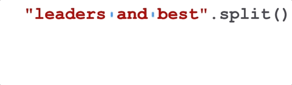
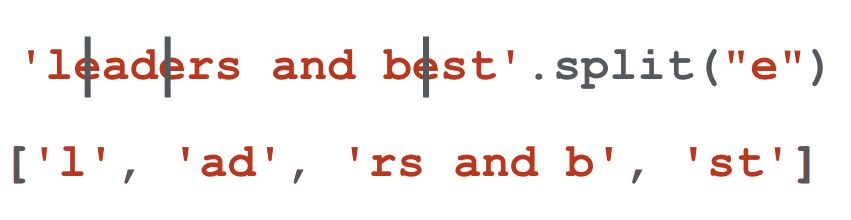
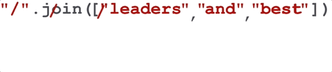

Splitting and Joining Strings
=============================

Two of the most useful methods on strings involve lists of strings. The ``split`` method breaks a string into a list 
of words. By default, any number of whitespace characters is considered a word boundary.

.. activecode:: ch09_split1
    
    song = "The rain in Spain..."
    wds = song.split()
    print(wds) 

An optional argument called a **delimiter** can be used to specify which characters to use as word boundaries. 

The following example uses the string ``ai`` as the delimiter:

.. activecode:: ch09_split2
    
    song = "The rain in Spain..."
    wds = song.split('ai')
    print(wds)

Notice that the delimiter doesn't appear in the result.

The inverse of the ``split`` method is ``join``.  You choose a
desired **separator** string, (often called the *glue*) 
and join the list with the glue between each of the elements.

.. activecode:: ch09_join

    wds = ["red", "blue", "green"]
    glue = ';'
    s = glue.join(wds)
    print(s)
    print(wds)

    print("***".join(wds))
    print("".join(wds))

The list that you glue together (``wds`` in this example) is not modified.  Also, 
you can use empty glue or multi-character strings as glue.
