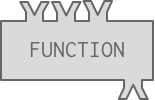
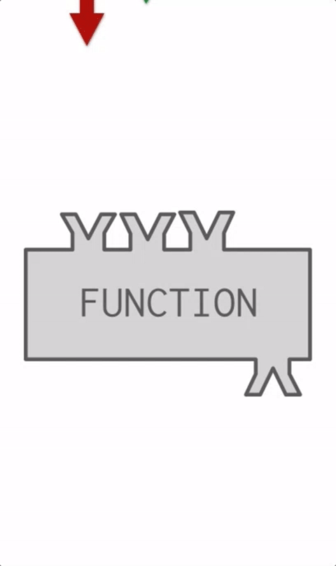

..  Copyright (C)  Brad Miller, David Ranum, Jeffrey Elkner, Peter Wentworth, Allen B. Downey, Chris
    Meyers, and Dario Mitchell.  Permission is granted to copy, distribute
    and/or modify this document under the terms of the GNU Free Documentation
    License, Version 1.3 or any later version published by the Free Software
    Foundation; with Invariant Sections being Forward, Prefaces, and
    Contributor List, no Front-Cover Texts, and no Back-Cover Texts.  A copy of
    the license is included in the section entitled "GNU Free Documentation
    License".

Function Calls
--------------

Python can compute new values with function calls. You are familiar with the idea of functions from high school algebra. There you might define a function ``f`` by specifying how it transforms an input into an output, ``f(x) = 3x + 2``. Then, you might write ``f(5)`` and expect to get the value 17.

Python adopts a similar syntax for invoking functions. If there is a named function ``foo`` that takes a single input, we can invoke foo on the value 5 by writing ``foo(5)``.

There are many built-in functions available in python. You'll be seeing some in this chapter and the next couple of chapters.

Functions are like factories that take in some material, do some operation, and then send out the resulting object.

In this case, we refer to the materials as arguments or inputs and the resulting object is refered to as output or return value. This process of taking input, doing something, and then sending back the output is demonstrated in the gif below.

It is also possible for programmers to define new functions in their programs. You will learn how to do that later in the course. For now, you just need to learn how to invoke, or call, a function, and understand that the execution of the function returns a computed value.

.. activecode:: functionCalls_1
   :nocanvas:
   :hidecode:

   def square(x):
      return x * x

   def sub(x, y):
      return x - y

We've defined two functions above. The code is hidden so as not to bother you (yet) with how functions are defined. 
``square`` takes a single input parameter, and returns that input multiplied by itself. ``sub`` takes two input 
parameters and returns the result of subtracting the second from the first. Obviously, these functions are not 
particularly useful, since we have the operators ``*`` and ``-`` available. But they illustrate how functions work. The visual below illustrates how the ``square`` function works.

.. image:: Figures/square_function.gif
   :alt: a visual of the square function. Four is provided as the input, the function object shakes, and then sixteen comes out from the bottom of the function object.

.. activecode:: functionCalls_2
   :include: functionCalls_1
   :nocanvas:

   print(square(3))
   square(5)
   print(sub(6, 4))
   print(sub(5, 9))

Notice that when a function takes more than one input parameter, the inputs are separated by a comma. Also notice 
that the order of the inputs matters. The value before the comma is treated as the first input, the value after it 
as the second input.

Again, remember that when python performs computations, the results are only shown in the output window if there's 
a print statement that says to do that.

You may be wondering now if print is a function. As mentioned above, functions can compute new values when the 
functions are called or invoked. Fuctions can be used for more than mathmatical computation though. Print is also a 
function that programmers use often to output data or check what is happenning in their code. If you come across 
Python 2 code you may notice that print statements do not require parentheses even though print is still a function 
in that version of Python. This is one of the differences between Python 2 and Python 3. In this course, we will be 
teaching Python 3 and using the parentheses. Each time we use a print statement we are calling the print function 
to execute the code.

Function calls as part of complex expressions
~~~~~~~~~~~~~~~~~~~~~~~~~~~~~~~~~~~~~~~~~~~~~

Anywhere in an expression that you can write a literal like a number, you can also write a function invocation that produces a number.

For example:

.. activecode:: functionCalls_2a
   :include: functionCalls_1
   :nocanvas:

   print(square(3) + 2)
   print(sub(square(3), square(1+1)))

Let's take a look at how that last execution unfolds.

.. showeval:: se_functionCalls_2a
   :trace_mode: true

   Notice that we always have to resolve the expression inside the innermost parentheses first, in order to determine what input to provide when calling the functions.
   ~~~~
   print(sub({{square(3)}}{{9}}, square(1+1)))
   print(sub(9, square({{1+1}}{{2}})))
   print(sub(9, {{square(2)}}{{4}}))
   print({{sub(9, 4)}}{{5}})

Functions are objects; parentheses invoke functions
~~~~~~~~~~~~~~~~~~~~~~~~~~~~~~~~~~~~~~~~~~~~~~~~~~~

Remember the earlier mention that some kinds of python objects don't have a nice printed representation? Functions 
are themselves just objects. If you tell python to print the function object, rather than printing the results of 
invoking the function object, you'll get one of those not-so-nice printed representations. Just stating the name of 
the function refers to the function. The name of the function followed by parentheses ``()`` invokes the function.

.. activecode:: functionCalls_3
   :include: functionCalls_1
   :nocanvas:

   print(square)
   print(sub)

We can do the same thing with the print function, however it looks odd in the textbook. If you print the print 
function in the textbook, then you will see ``<function <native JS>>``.
Executing this code outside of the textbook though will return ``<built-in function print>``. 

.. activecode:: functionCalls_4
   :nocanvas:

   print(print)